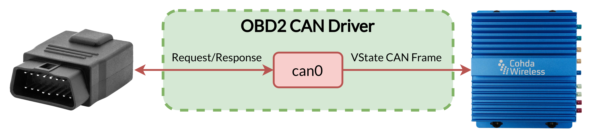
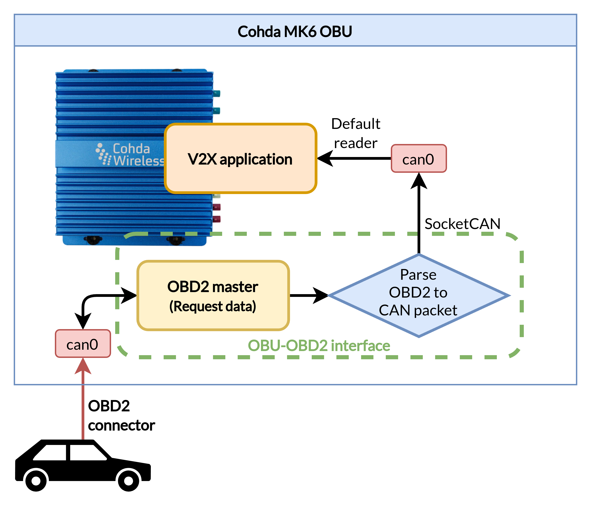

# OBD2 CAN Driver for Cohda MK6 OBU

<p align="center">
  
</p>

<p align="center">
  
</p>

## Clonning

```shell
git clone https://github.com/LMA-FEM-UNICAMP/OBD2-CAN-Driver.git
```

## Compiling

Install CMake and Make:

```shell
sudo apt update
sudo apt install build-essential
sudo apt install cmake
```

Compile:

```shell
cd obd2_can_driver
cmake .
make
make install
```

## Running (for testing)

```shell
sudo ./obd2_can_driver_exe can_in vcan_out
```

Checking daemon:

```shell
sudo ./obd2_can_driver_daemon can_in vcan_out
```

```shell
# Process
ps aux | grep obd2_can_driver_daemon

# Log
sudo journalctl -xe | grep obd2_can_driver_daemon

# Output
nc -U /tmp/obd2_can_logging.sock
```

## Installing the Daemon

```ini
# In the file /etc/systemd/system/obd2_can_driver_daemon.service
[Unit]
Description=OBD2 CAN Driver Daemon
After=network.target

[Service]
ExecStart=/opt/obd2_can_driver/bin/obd2_can_driver_daemon
Restart=always

[Install]
WantedBy=multi-user.target
```

Or

```shell
# From OBD2-CAN-Driver/services/
cp obd2_can_driver_daemon.service /etc/systemd/system
```

Then to activate the daemon:

```shell
sudo systemctl enable obd2_can_driver_daemon
sudo systemctl start obd2_can_driver_daemon
```

## Reading daemon status

Run `obd2_can_driver_status` command to echo the output from the daemon:

```shell
obd2_can_driver_status
```

## Configuring virtual CAN interface for Input/Output buses

```ini
# In the file /etc/systemd/system/vcan0.service
[Unit]
Description=Virtual CAN interface vcan0
After=network.target

[Service]
Type=oneshot
ExecStart=/sbin/ip link add dev vcan0 type vcan
ExecStartPost=/sbin/ip link set up vcan0
ExecStop=/sbin/ip link delete vcan0
RemainAfterExit=yes

[Install]
WantedBy=multi-user.target
```

Or

```shell
# From OBD2-CAN-Driver/services/
cp vcan0.service /etc/systemd/system
```

Then to configure the `vcan0` on startup:

```shell
sudo systemctl enable vcan0.service
sudo systemctl start vcan0.service
```